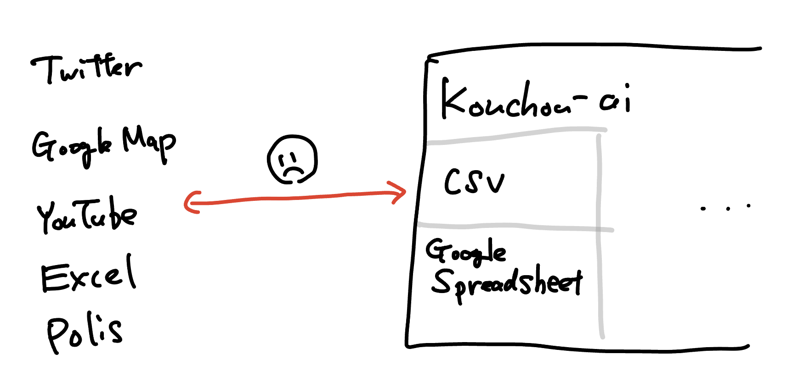
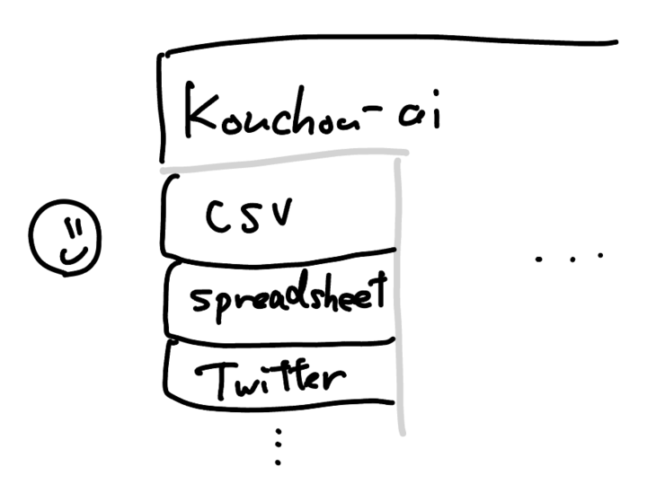
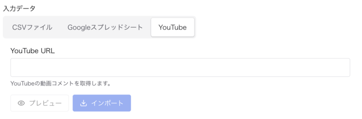
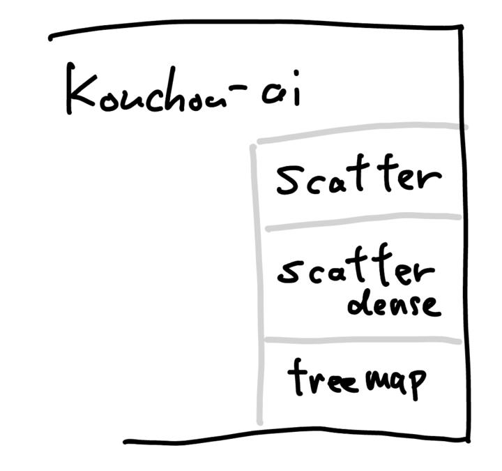
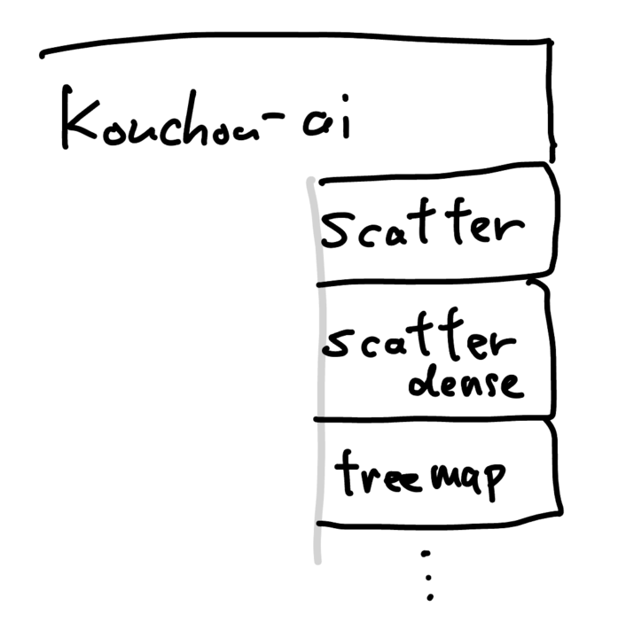
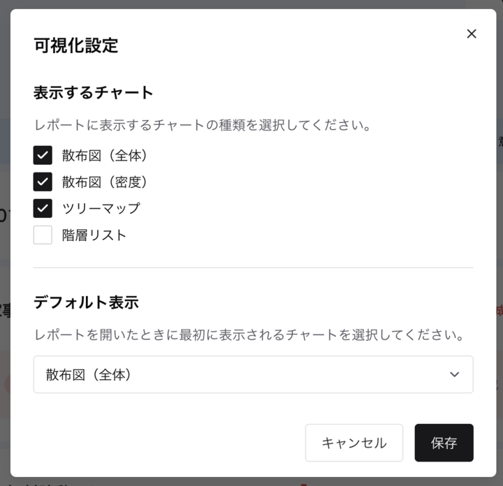
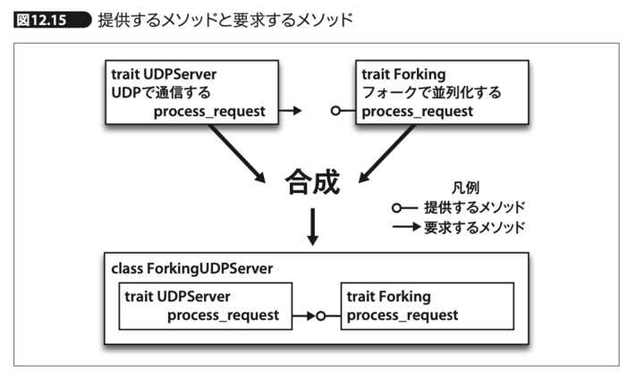

# プラグインシステムが必要な理由

広聴AIは、互換性を守って安定運用したい要求と、破壊的な新機能（解析手法・ビュー・入力ソース）を試したい要求が、単一のコア実装の中で衝突しやすい。合意形成だけで解こうとすると意思決定が止まるため、技術的な境界が必要になる。

プラグインアーキテクチャはこの衝突を分離する仕組みだ。コアは壊れにくい契約（API/manifest）と実行基盤に集中し、実験的な機能追加はプラグインとして試行錯誤・進化させる。重要なのはプラグイン機構そのものだけでなく、見つける・導入する・更新する・危険なら止めるという流通と統治の設計である。

## 1. 現状のデッドロックを技術的に定義する

- A: 互換性を保ちたい（安定版が必要／自治体案件で壊せない）
- B: 新機能を試したい（アルゴリズム、ビュー、入力、運用連携）

これらを単一アプリのコアに同居させると、以下が発生する。

- 使わない人にもデフォルトで機能や依存が乗る
- 依存が増えてセットアップが重くなる
- 設定が巨大化して混乱する
- Bの新機能がAの維持したい互換性を壊す

合意形成の問題に見えるが、本質は「境界がない設計」にある。

## 2. 入力プラグイン: 収集のギャップを埋める

以前の広聴AIは入力としてCSVとGoogle Spreadsheetしか受け付けなかった。そのため、TwitterやGoogle Map、YouTubeなど他の入力ソースを活用したくても、エンジニアのいない自治体は実行できない。

これまでは「CSV化は広聴AIの担当範囲ではないので各自治体がやる」という境界線だった。しかし広聴AIの理想は、非エンジニアがレポート作成をエンジニアに依頼せずに実行できることにある。入力をプラグインで拡張可能にすることで、エンジニアが目的に合ったプラグインを作って差し込む運用ができるようになる。

プラグインを追加するだけで下記のように管理画面に統合されるため、ギャップを埋めるエンジニアの負担も、非エンジニアの利用負担も下げられる。

## 3. 可視化プラグイン: 固定実装からの脱却

可視化は当初、散布図・濃い意見散布図・ツリーマップの3種類が決め打ちで、ソースコードにもハードコードされていた。

以下の問題が指摘されていて、改善方法も提案されているがなかなか広聴AIのコードに入っていかなかった。見た目が変わるため「こう変更すべきだ」という意見と「従来の見た目をユーザは好むかもしれない」という意見が衝突してしまうからだ。

- 散布図の縦横比が維持されない
- ツリーマップの操作が難しく、わかりにくい
- 散布図が前提になることで、解析側が座標データ出力に縛られる

そこで可視化をプラグインとして追加できるようにした。

なお、可視化手法ごとに要求するデータ構造が異なるため、機械的な検証手段を備えるのが望ましい（現状は仕組みを用意した段階で、検証の完全性は未検証）。

どれを使うかはレポートの管理者が選べる。これによって「ユーザが前の見た目を好むかもしれない」という懸念がなくなる。前の見た目をデフォルトにしておけば良いからである。

どの可視化手法が良いかは実物を見ないと議論できない。プラグインとして切り出すことで「本体に悪影響はない」という境界を作り、各自が気軽に試作し、実際の利用者が見て選べるようにする。

## 4. 解析プラグイン: 置き換え可能性の担保

解析プラグインは理屈の上では差し替え可能になっている。現時点では差し替え対象の解析手段がまだ少ないため、段階的に整備し、差し替える実験を行なっていく。

## 5. プラグインが増えたときの運用課題

想定される課題は大きく2つある。

- 互換性がない、または機能しない
- たくさんのプラグインからどう選ぶか

互換性はデータ型の整合性チェックに帰着するため、各プラグインが「何を require し、何を supply するか」を機械可読に表明し、プラットフォーム側が整合性チェックを行う。

「たくさんからどう選ぶか」は増えてから本格対応すればよいが、初期は簡易リストで十分だ。増えてきた段階で、利用事例・評価・更新頻度などを併記できるカタログを用意し、実績や新鮮さが伝わる並びにする。
