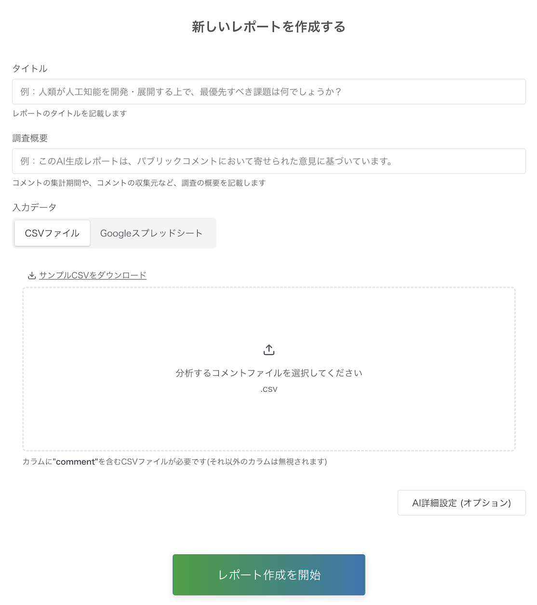
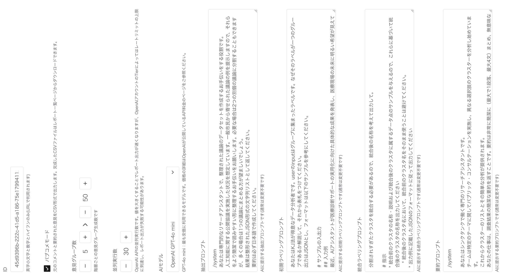

# 広聴AIの使い方

本ドキュメントでは、アプリを立ち上げた後の利用方法について記載しています。

## 前提

- 広聴AIでは以下の 2 種類のユーザーを想定しています
  - レポートの作成者
    - アプリ上でレポート作成を実行する担当者
    - 必要に応じて、プロンプトやパラメータ、入力データの調整等を行う
  - レポートの閲覧者
    - レポートを閲覧するユーザー
    - レポート作成は実施せず、閲覧のみが可能

# 管理画面(admin)

- 管理画面では、レポートの作成等の管理を行うことが可能
- 管理画面を操作するのはレポートの作成者のみ
- アプリ起動時に環境変数でベーシック認証に関する変数を設定している場合、管理画面の閲覧にはユーザー名とパスワードによる認証が必要
  - 環境変数がセットされていない場合、認証はスキップされます

レポートの作成は以下の画面で実施できます。
csv をアップロードし、各設定項目を入力し、「レポート作成を開始」ボタンを押下することでレポートの作成が開始します。


より高度な設定を行いたい場合は、「AI 詳細設定」を押下することで、プロンプトやクラスタ数等のパラメータを調整することが可能です。



また、「AI 詳細設定」には **CSV出力モード** の設定項目が追加されています。
このモードを有効にすると、レポート作成時に **要約された意見、クラスタ名、および元のコメント原文** を含む **CSV ファイル** が作成されます。

CSV ファイルをアップロードする際には、コメント数に基づいた **おすすめクラスタ数設定** が初期値として設定されます。

生成された CSV ファイルは、管理者向けの **レポート一覧ページ** からダウンロード可能です。

# レポート表示画面(public-viewer)

- レポート表示画面では、レポートの閲覧が可能
- 対象ユーザーはレポートの閲覧者
- レポート画面は以下の要素で構成される
  - クラスタリングの可視化結果
    - 詳細は[クラスタリングの可視化結果について](#cluster-visualization)を参照
  - 各クラスタの説明文
    - 各クラスタについて AI で生成された説明文
  - 分析に関する処理・データの詳細
    - コメント数、クラスタ数等のデータに関する数字や、使用したプロンプト等の情報
  - 分析実行者の情報
    - metadata 等で定義した情報

## クラスタリングの可視化結果について {#cluster-visualization}

- 広聴AIでは[階層クラスタリング](https://en.wikipedia.org/wiki/Hierarchical_clustering)を行っており、複数階層で、それぞれ異なる粒度でクラスタリングを行っています。
  - クラスタリングのパラメータは、レポート作成時に「AI詳細設定」で調整可能です。
- 階層型クラスタリングの結果に対して、以下の 3 種類の可視化方法を用意しています
  - 全体図
    - 階層クラスタリングにおける、**最上層のクラスタ**を散布図で可視化したもの
  - 濃いクラスタ
    - 階層クラスタリングにおける、**最下層のクラスタ**を、しきい値でフィルタリングして可視化したもの
      - より似通ったデータ点のみが凝集しているクラスタに絞って可視化を行うためにこちらの可視化方法を用意しています
      - しきい値はレポート表示画面の「濃いクラスタ設定」で調整可能です
  - 階層図
    - 全階層のデータをツリーマップ形式で可視化したもの

## レポートを公開する前のリンク確認

公開先で表示される作成者名やリンクを確認してください。開発用の画面で正しく見えていても、実際の公開サイトやダウンロードした静的サイトへ設定が反映されているとは限りません。

| 確認するもの | 現行の設定場所・表示条件 |
| --- | --- |
| 作成者名・紹介文 | `apps/api/public/meta/custom/metadata.json`の`reporter`・`message` |
| 作成者のウェブページ | 同ファイルの`webLink`。作成者情報欄に表示 |
| プライバシーポリシー | 同ファイルの`privacyLink`。作成者情報欄に表示 |
| 利用規約 | 同ファイルの`termsLink`。作成者情報欄とフッターに表示 |
| ヘッダーのメニュー | `apps/public-viewer/components/globalNavigation/GlobalNavigation.tsx`の`navItems`。現在は「レポート一覧」と「よくあるご質問」 |
| フッターのプロジェクト紹介・SNS等 | `apps/public-viewer/components/Footer.tsx`のリンク。作成者情報のリンクとは別に確認 |

customのJSONがなければ`apps/api/public/meta/default/metadata.json`が使われます。デフォルト設定ではAPIが作成者のリンクを返さず、`isDefault: true`になります。独自のリンクを出す場合はcustom側に設定してください。`isDefault`はAPIが付ける値なので、JSONに手で追加する必要はありません。

customの設定例（URLは公開者自身のものに置き換えてください）：

```json
{
  "reporter": "レポート発行者名",
  "message": "このレポートの作成目的と問い合わせ先を記載します。",
  "webLink": "https://example.org/",
  "privacyLink": "https://example.org/privacy",
  "termsLink": "https://example.org/terms",
  "brandColor": "#2577b1"
}
```

公開前には次を確認します。

- [ ] 公開用APIの`/meta/metadata.json`に意図した値が返る。
- [ ] 一覧とレポート詳細の作成者名・紹介文・リンクが、公開者の設定になっている。
- [ ] プライバシーポリシーと利用規約を実際に開き、到達先が正しく、下書きや閲覧権限の必要なページになっていない。
- [ ] ヘッダー・フッター・紹介文に追加したリンクに、localhostやテスト環境へのリンクが残っていない。現在の標準ヘッダーメニューに「テスト環境」はないため、独自に追加したメニューも確認する。
- [ ] 375px程度の狭い画面でもメニューを開き、リンクを確認する。
- [ ] 通常の静的exportは設定変更後に出力し直し、出力先で確認する。shell配布物は同梱する`data/metadata.json`を更新して組み立て直す。API側の変更だけでは、配布済みの静的サイトには反映されない。

ソースコード中のメニュー等を変更した場合はviewerの再ビルドが必要です。shell方式の組立手順は[開発ガイド](../development/static-shell-export.md)を参照してください。
