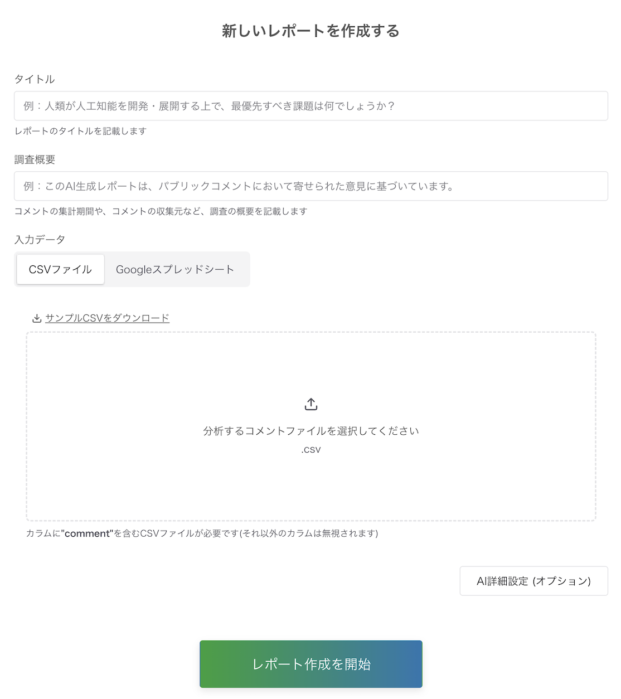
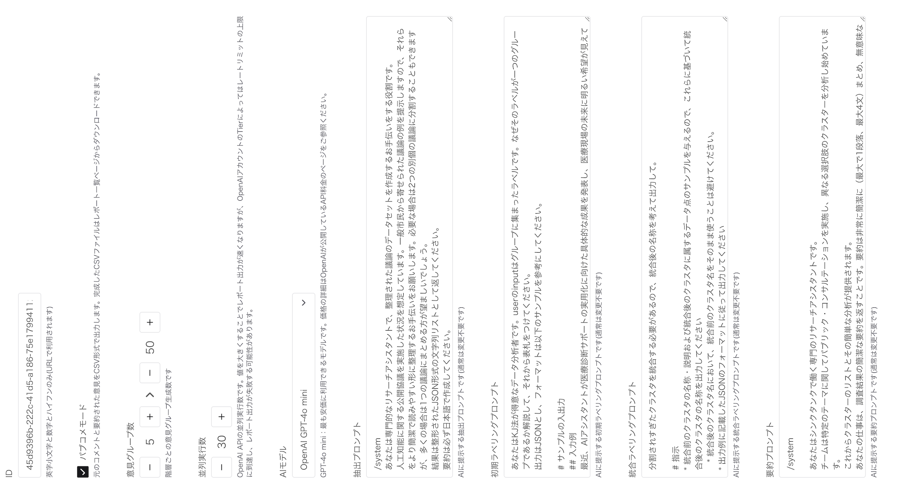

# 広聴AIの使い方

本ドキュメントでは、アプリを立ち上げた後の利用方法について記載しています。

分析結果やHTMLを公開するときの案内は、[ライセンスと結果の公開](license.md)を参照してください。

## 前提

- 広聴AIでは以下の 2 種類のユーザーを想定しています
  - レポートの作成者
    - アプリ上でレポート作成を実行する担当者
    - 必要に応じて、プロンプトやパラメータ、入力データの調整等を行う
  - レポートの閲覧者
    - レポートを閲覧するユーザー
    - レポート作成は実施せず、閲覧のみが可能

# 管理画面(admin)

- 管理画面では、レポートの作成等の管理を行うことが可能
- 管理画面を操作するのはレポートの作成者のみ
- アプリ起動時に環境変数でベーシック認証に関する変数を設定している場合、管理画面の閲覧にはユーザー名とパスワードによる認証が必要
  - 環境変数がセットされていない場合、認証はスキップされます

レポートの作成は以下の画面で実施できます。
csv をアップロードし、各設定項目を入力し、「レポート作成を開始」ボタンを押下することでレポートの作成が開始します。


より高度な設定を行いたい場合は、「AI 詳細設定」を押下することで、プロンプトやクラスタ数等のパラメータを調整することが可能です。



「AI 詳細設定」では **分析方式** も選択できます。

- **埋め込みベース（階層クラスタリング）**（既定）: コメントを埋め込みベクトルに変換し、階層クラスタリングでグループ化します。
- **LLM 直接グルーピング（LLM grouping）**: LLM がコメントから直接グループを発見し、各コメントをグループへ割り当てます（散布図の座標は埋め込み由来を維持します）。この方式ではクラスタ数の設定や、初期・統合ラベリングのプロンプトは使用されません。

また、「AI 詳細設定」には **CSV出力モード** の設定項目が追加されています。
このモードを有効にすると、レポート作成時に **要約された意見、クラスタ名、および元のコメント原文** を含む **CSV ファイル** が作成されます。

CSV ファイルをアップロードする際には、コメント数に基づいた **おすすめクラスタ数設定** が初期値として設定されます。

生成された CSV ファイルは、管理者向けの **レポート一覧ページ** からダウンロード可能です。

# レポート表示画面(public-viewer)

- レポート表示画面では、レポートの閲覧が可能
- 対象ユーザーはレポートの閲覧者
- 表示言語は日本語・英語・韓国語から選べる（[表示言語の切り替え](#language-switch)を参照）
- レポート画面は以下の要素で構成される
  - クラスタリングの可視化結果
    - 詳細は[クラスタリングの可視化結果について](#cluster-visualization)を参照
  - 各クラスタの説明文
    - 各クラスタについて AI で生成された説明文
    - 散布図でのクラスタ選択や表示モードに連動します（[散布図の操作](#scatter-operations)を参照）
  - 分析に関する処理・データの詳細
    - コメント数、クラスタ数等のデータに関する数字や、使用したプロンプト等の情報
  - 分析実行者の情報
    - metadata 等で定義した情報

## クラスタリングの可視化結果について {#cluster-visualization}

- 広聴AIでは[階層クラスタリング](https://en.wikipedia.org/wiki/Hierarchical_clustering)を行っており、複数階層で、それぞれ異なる粒度でクラスタリングを行っています。
  - クラスタリングのパラメータは、レポート作成時に「AI詳細設定」で調整可能です。
- 階層型クラスタリングの結果に対して、**散布図**（「全体 / 詳細クラスタ / 濃い意見」の 3 モード）と**階層図**を用意しています。散布図のモードは全画面表示のまま切り替えられます（[散布図の操作](#scatter-operations)を参照）。
  - 全体（全体図）
    - 階層クラスタリングにおける、**最上層のクラスタ**を散布図で可視化したもの
  - 詳細クラスタ
    - **最下層（最も細かい粒度）のクラスタ**をすべて散布図で可視化したもの
  - 濃い意見（濃いクラスタ）
    - **最下層のクラスタ**を、しきい値でフィルタリングして可視化したもの
      - より似通ったデータ点のみが凝集しているクラスタに絞って可視化を行うためにこちらの可視化方法を用意しています
      - しきい値はレポート表示画面の「濃いクラスタ設定」で調整可能です
  - 階層図
    - 全階層のデータをツリーマップ形式で可視化したもの

## 散布図の操作 {#scatter-operations}

散布図（全体 / 詳細クラスタ / 濃い意見）では、次の操作ができます。

- **粒度の切り替え**: 散布図の上部で「全体 / 詳細クラスタ / 濃い意見」を切り替えられます。**全画面表示のまま**切り替えられ、全画面を終了した後の通常表示にも選択が引き継がれます。ズーム・パンの状態は切り替えても保持されます。（切り替え先が 1 つしかない場合や、階層図・一覧を全画面表示している間は、切り替え UI は表示されません。全画面表示は PC での閲覧を前提としています。）
- **ズーム・パン**: ドラッグで表示位置を移動（パン）、マウスホイール / ピンチで拡大・縮小、右上のツールバーで拡大・移動・初期表示へのリセットができます。操作方法はヒントアイコンからも確認できます。
- **クラスタの選択と連動**: 散布図でクラスタ（点）をクリックすると、下部の各クラスタの説明文一覧で該当項目がハイライトされ、自動でスクロールします。説明文は表示モード（全体 / 詳細クラスタ / 濃い意見）に連動して更新されます。属性フィルターを適用している場合、一覧の件数は「N 件（フィルター後）」と表示されます。
- **元コメントの確認**: レポート作成時に「AI詳細設定」で「元コメントの本文を公開レポートに含める」を ON にしたレポートでは、点にカーソルを合わせると、抽出された意見の下に元コメントの本文（長い場合は先頭部分）が表示されます。階層リスト（一覧）でも、各意見の下に元コメントが表示されます。この設定は既定で OFF で、ON にするとレポートを閲覧できる人全員が元コメントの本文を読めるため、入力データの引用・再頒布が許されている場合だけ ON にしてください。非公開にした属性値を持つコメントは含まれません。
- **「濃い意見」での帰属表示**: 「濃い意見」モードでは、各クラスタが**どの最上層（第一階層）クラスタに属するか**を、凡例「濃い意見グループの第一階層クラスタへの帰属」で色とラベル付きで示します。点にカーソルを合わせると「所属: &lt;第一階層クラスタ名&gt;」が表示されます。

## 表示言語の切り替え {#language-switch}

レポート画面の右上で、表示言語を「日本語 / English / 한국어」から選べます。全画面表示中もツールバーから切り替えられます。

- ボタン・説明・散布図の操作ヒントなどの画面の文言は、選んだ言語で表示されます。ヘッダー・フッター・レポート一覧は日本語のままです。
- レポート本文（意見グループ名・説明・概要・問いなど）は、分析結果に選んだ言語の訳があれば訳で表示します。選んだ言語の訳が無いレポートは元の言語のまま表示し、その旨を注記します。訳に含まれない部分（意見本文など）も元の言語で表示されます。
- 訳は、分析の後で analysis-core の `kouchou-translate` を実行して `hierarchical_result.json` に追加します（使い方は packages/analysis-core/README.md を参照）。意見本文は件数が多いため、`--include-arguments` を付けたときだけ訳します。
- 選んだ言語は URL の `?lang=`（例: `?lang=en`）とブラウザに保存されます。言語を選んだ状態のリンクを共有すると、同じ言語で開けます。

## レポートを公開する前のリンク確認 {#pre-publish-check}

公開先で表示される作成者名やリンクを確認してください。開発用の画面で正しく見えていても、実際の公開サイトやダウンロードした静的サイトへ設定が反映されているとは限りません。

| 確認するもの | 現行の設定場所・表示条件 |
| --- | --- |
| 作成者名・紹介文 | `apps/api/public/meta/custom/metadata.json`の`reporter`・`message` |
| 作成者のウェブページ | 同ファイルの`webLink`。作成者情報欄に表示 |
| プライバシーポリシー | 同ファイルの`privacyLink`。作成者情報欄に表示 |
| 利用規約 | 同ファイルの`termsLink`。作成者情報欄とフッターに表示 |
| ヘッダーのメニュー | `apps/public-viewer/components/globalNavigation/GlobalNavigation.tsx`の`navItems`。現在は「レポート一覧」と「よくあるご質問」 |
| フッターのプロジェクト紹介・SNS等 | `apps/public-viewer/components/Footer.tsx`のリンク。作成者情報のリンクとは別に確認 |

customのJSONがなければ`apps/api/public/meta/default/metadata.json`が使われます。デフォルト設定ではAPIが作成者のリンクを返さず、`isDefault: true`になります。独自のリンクを出す場合はcustom側に設定してください。`isDefault`はAPIが付ける値なので、JSONに手で追加する必要はありません。

customの設定例（URLは公開者自身のものに置き換えてください）：

```json
{
  "reporter": "レポート発行者名",
  "message": "このレポートの作成目的と問い合わせ先を記載します。",
  "webLink": "https://example.org/",
  "privacyLink": "https://example.org/privacy",
  "termsLink": "https://example.org/terms",
  "brandColor": "#2577b1"
}
```

公開前には次を確認します。

- [ ] 公開用APIの`/meta/metadata.json`に意図した値が返る。
- [ ] 一覧とレポート詳細の作成者名・紹介文・リンクが、公開者の設定になっている。
- [ ] プライバシーポリシーと利用規約を実際に開き、到達先が正しく、下書きや閲覧権限の必要なページになっていない。
- [ ] ヘッダー・フッター・紹介文に追加したリンクに、localhostやテスト環境へのリンクが残っていない。現在の標準ヘッダーメニューに「テスト環境」はないため、独自に追加したメニューも確認する。
- [ ] 375px程度の狭い画面でもメニューを開き、リンクを確認する。
- [ ] 通常の静的exportは設定変更後に出力し直し、出力先で確認する。shell配布物は同梱する`data/metadata.json`を更新して組み立て直す。API側の変更だけでは、配布済みの静的サイトには反映されない。

ソースコード中のメニュー等を変更した場合はviewerの再ビルドが必要です。shell方式の組立手順は[開発ガイド](../development/static-shell-export.md)を参照してください。
